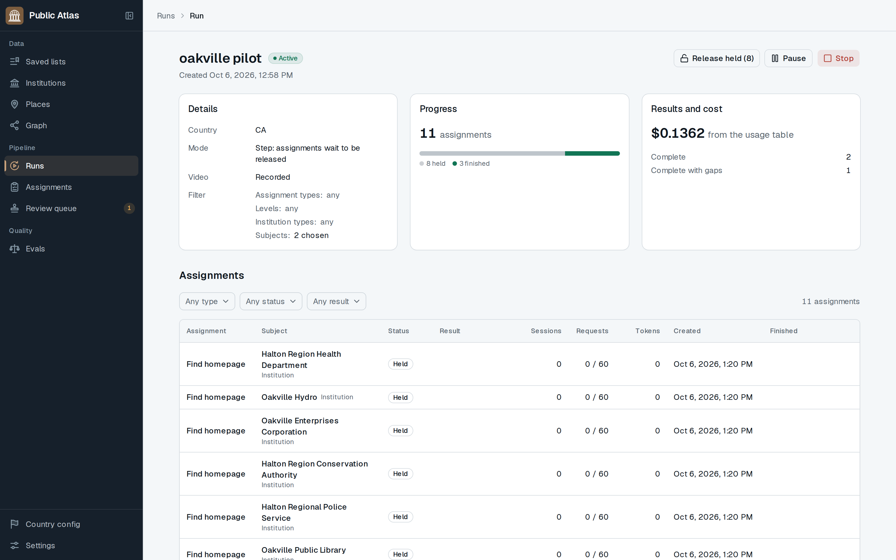
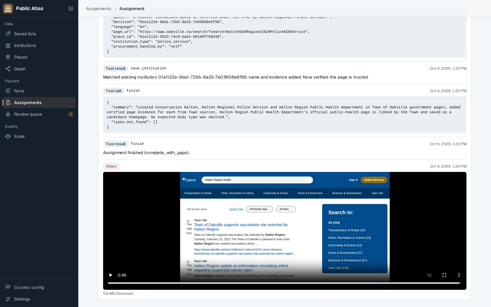
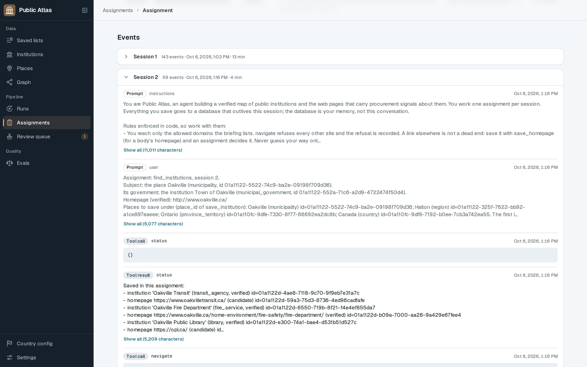
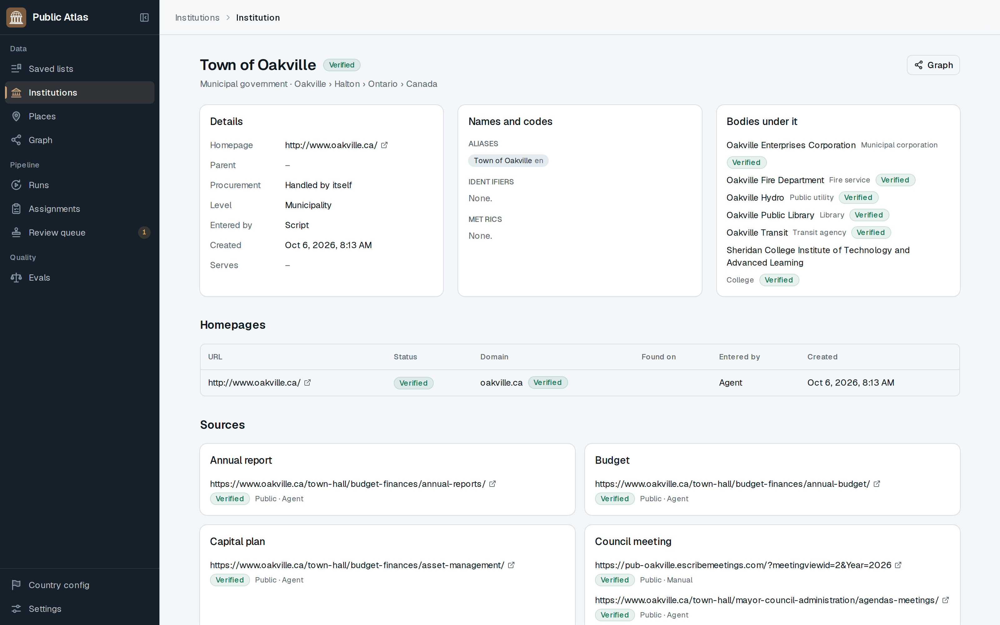
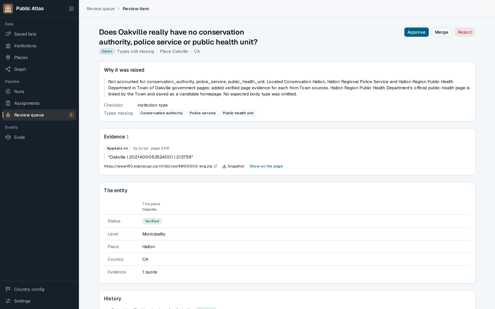
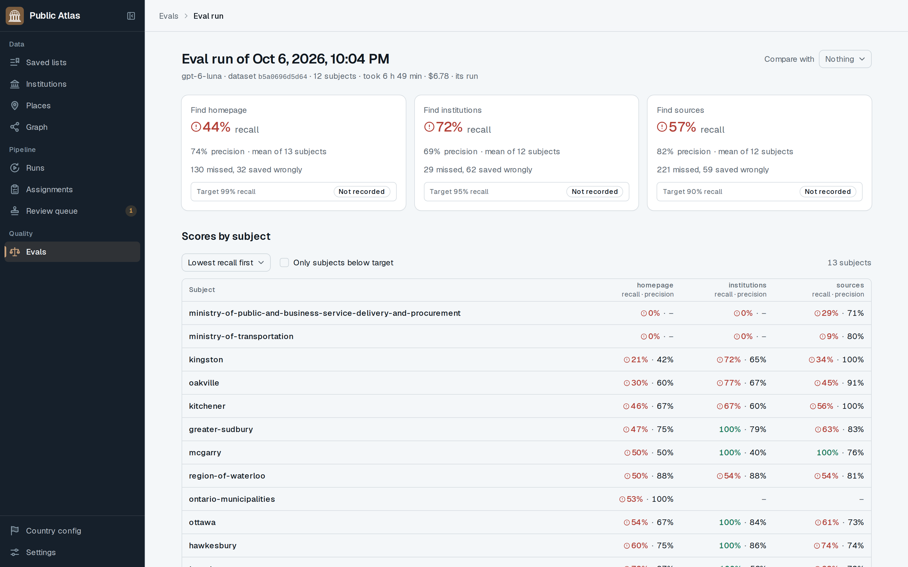
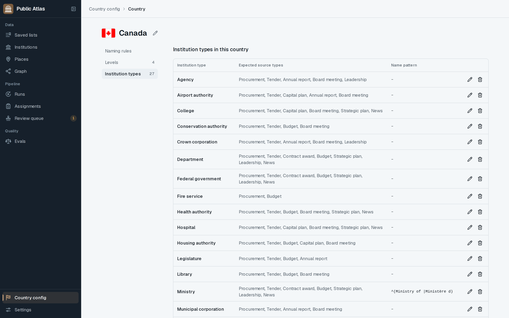
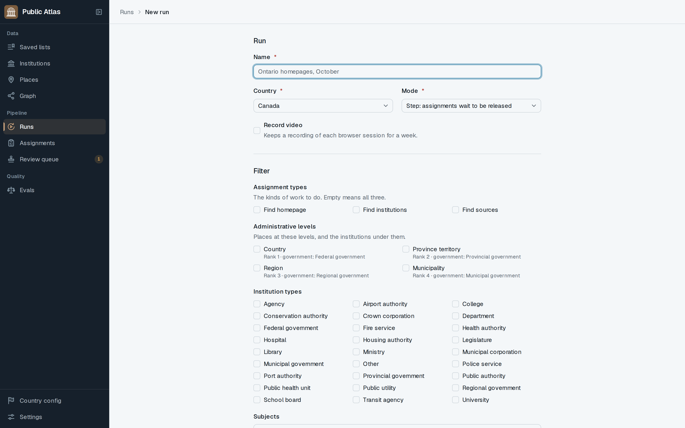
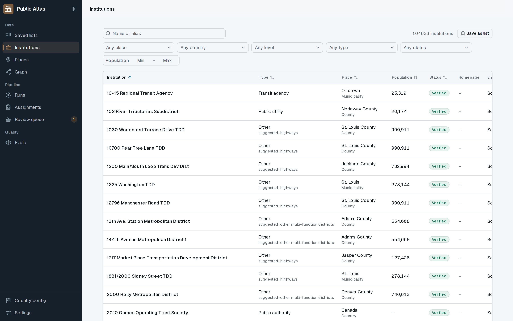
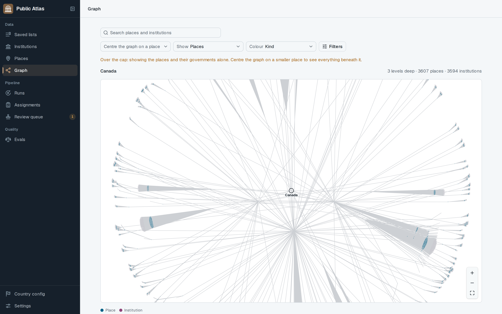

# Public Atlas

Public Atlas maps the public sector for companies that sell to governments. It finds every
public body in a country (governments, school boards, transit agencies, police boards, health
units, libraries, crown corporations and so on), its official website, and the pages on that
site that carry buying signals: budgets, capital plans, council and board minutes, procurement
portals, tenders, contract awards and strategic plans.

The hard part is not finding pages. It is finding _all_ of them, knowing which body each one
belongs to, and being able to prove it. So the project is built around three ideas:

1. **Official lists first, agents second.** Where a government publishes a register (a census
   file, a municipal directory, a list of agencies), a scripted loader reads it, and the AI
   agent only fills the gaps. Twenty-eight such lists cover Canada and the United States today.
2. **Nothing is true without evidence.** The agent browses official websites, but it cannot
   just assert a fact. Each finding comes with a quote, the system stores a copy of the page,
   and code checks that the quote is really on it. Only then is the fact _verified_. Anything
   the rules cannot settle goes to a person through a review queue.
3. **Measured, not felt.** A hand-labelled dataset of Ontario municipalities scores every
   change: recall and precision per assignment type, and the dollar cost of getting there.

## Screenshots

|                                                                                                                                                                    |                                                                                                                                                  |
| ------------------------------------------------------------------------------------------------------------------------------------------------------------------ | ------------------------------------------------------------------------------------------------------------------------------------------------ |
| **Run**: its filter and mode, progress and cost, its assignments, and release / pause / stop<br>                                  | **Assignment detail**: every tool call and result, the finish, and the browser session's video<br> |
| **Session timeline**: the system prompt, the briefing, then each model turn, tool call and result<br>   | **Institution**: type, parent, homepage, the bodies under it, and its sources by type<br>        |
| **Review item**: the question, why it was raised, the evidence, the entity, and approve / merge / reject<br>                 | **Eval run**: recall and precision per assignment type against the gates, then by subject<br>                |
| **Country config**: a country's levels, institution types and the sources expected of each<br>                         | **New run**: a country, a mode, and a filter by assignment type, level, institution type and subject<br> |
| **Institutions**: the whole graph as a table, filtered by place, country, level, type, status and population<br> | **Graph**: places and the institutions under them, centred on any place<br>                                  |

## How it works

**Data enters the graph three ways.** A _seed_ creates a country, its top-level places and the
domains trusted by hand. _Official lists_ load places and institutions from government
registers, each pinned by URL and hash so a fresh clone rebuilds the same database. _Assignments_
send the agent after everything the lists do not cover.

**There are three kinds of assignment.** `find_homepage` finds and verifies the official site
of one institution. `find_institutions` finds the public bodies under one place.
`find_sources` finds the signal pages of one institution. A _run_ picks a filter (country,
level, place, type) and a mode, then creates assignments for all the work due. Each finding
that calls for more work spawns the next assignment, so one run over a province fans out on
its own and never queues the same work twice.

**The agent is fenced.** It works in a real Chromium that only reaches approved domains,
honours `robots.txt`, paces requests across sessions and refuses private addresses. Every page
it lands on is captured as a snapshot. A domain becomes trusted only through a chain back to
an official register: a trusted page must link to it, or a reviewer approves it. PDFs and
spreadsheets are parsed on a separate worker, lazily, a range of pages at a time.

**Everything is bounded and observable.** Each assignment has a request budget and a model
chosen per type. A session ends when it finishes, runs out of budget, or passes half its
context window, in which case it writes a handoff note and a fresh session picks up. Every
model and search call is a priced `usage` row. Every session's events, tool calls and video
are kept for replay in the console.

**A run is a distributed-systems problem.** Work is queued through PostgreSQL (no broker), so a
job commits or rolls back with the rows it is about. A worker whose heartbeat stops has its
jobs requeued. Pausing a run puts picked-up jobs back with a delay. Every status change goes
through one door, so there is one place to look when something is wrong.

## Tech stack

| Layer   | Choice                                                                                                                                 |
| ------- | -------------------------------------------------------------------------------------------------------------------------------------- |
| API     | Python 3.14, FastAPI, SQLAlchemy 2 async, Alembic, PostgreSQL (`pg_trgm` for duplicates)                                               |
| Jobs    | Procrastinate on the same PostgreSQL. Queues: `assignment`, `parse`, `default`                                                         |
| Agent   | Pydantic AI; model and reasoning effort set per assignment type                                                                        |
| Browser | Playwright Chromium behind one policy object                                                                                           |
| Parsing | Docling, on the `parse` worker image only                                                                                              |
| Storage | S3-compatible: RustFS locally, Cloudflare R2 hosted                                                                                    |
| Search  | Brave Search behind a port, off unless configured                                                                                      |
| Console | Next.js 16, shadcn/ui, TanStack Query and Table, a generated API client                                                                |
| Tooling | pnpm via [Vite+](https://viteplus.dev), [uv](https://docs.astral.sh/uv), Ruff, [ty](https://docs.astral.sh/ty), oxlint, Vitest, pytest |

One image per process (`api`, `worker`, `agent`, `parse`, `web`), settings from
`PUBLIC_ATLAS_*` environment variables (documented in `apps/server/.env.example`), images built
by GitHub Actions after CI passes. Dependencies are held back four days before install and
every action is pinned to a commit.

## Running it

Needs Node 24+, uv 0.12+ (it downloads Python 3.14) and Docker with Compose.

```sh
vp install && vp config          # dependencies and the pre-commit hook
vp run infra:up                  # PostgreSQL and RustFS in Docker
vp run db:migrate
vp run browser:install           # Playwright's Chromium, once per machine
cd apps/server
uv run public-atlas seed canada
uv run public-atlas load-list canada/ontario/places --apply
cd ../..
vp run dev                       # API on :8000, worker, console on :3000
```

Then, with `PUBLIC_ATLAS_OPENAI_API_KEY` set in `apps/server/.env`:

```sh
cd apps/server
uv run public-atlas run create pilot --mode step --level municipality --video   # a run, holding its assignments
uv run public-atlas run release <run id> --limit 2                             # let two through
uv run public-atlas eval run                                                   # the quick eval: five subjects and the places file
uv run public-atlas --help                                                     # seed, load-list, lists, run, eval, worker
```

`vp run check` formats, lints and type-checks both languages; `vp run test` runs Vitest and
pytest; `vp run ci` is what CI runs.

## Layout

```
apps/server/src/public_atlas/     the FastAPI app, the workers and the agent
  modules/countries/              country tables, seeds, naming rules
  modules/graph/                  places, institutions, sources, domains, homepages, status changes
  modules/evidence/               snapshots, quotes and the quote check, page capture, parse jobs
  modules/review/                 the review queue: approve, reject, merge
  modules/assignments/            runs, assignments, spawning, budgets, the run job
  modules/agent/                  sessions, briefing, findings, tools, events, video
  modules/imports/lists/          one module per official list, by country and region
  modules/evals/                  dataset, harness, scorer
  integrations/                   storage, search, parse, browser, ai: one port each
apps/web/                         the console (Next.js)
packages/api-client/              typed client generated from the API's OpenAPI schema
docs/                             the spec, glossary, build order and eval results
```

The full design is [docs/product-and-tech-spec.md](docs/product-and-tech-spec.md). The words
the code uses are in [docs/glossary.md](docs/glossary.md): one word per concept, no synonyms.
